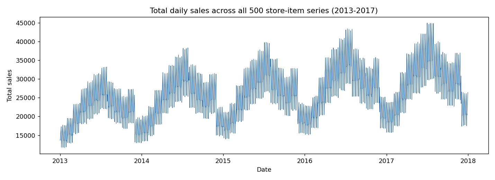
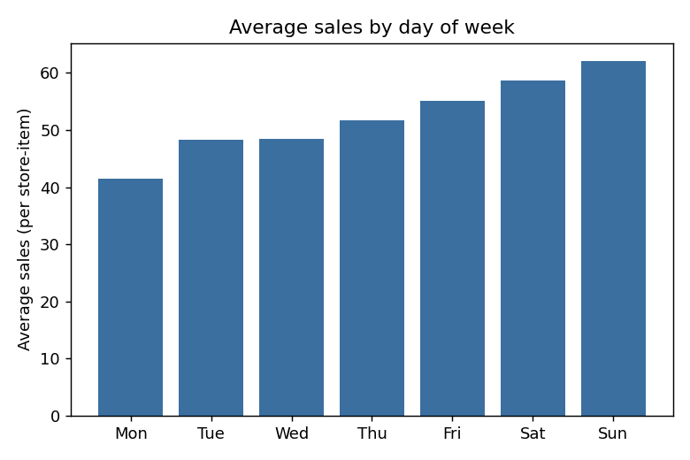
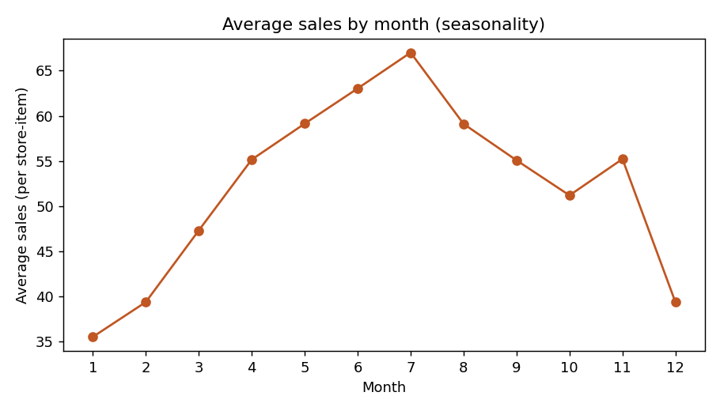
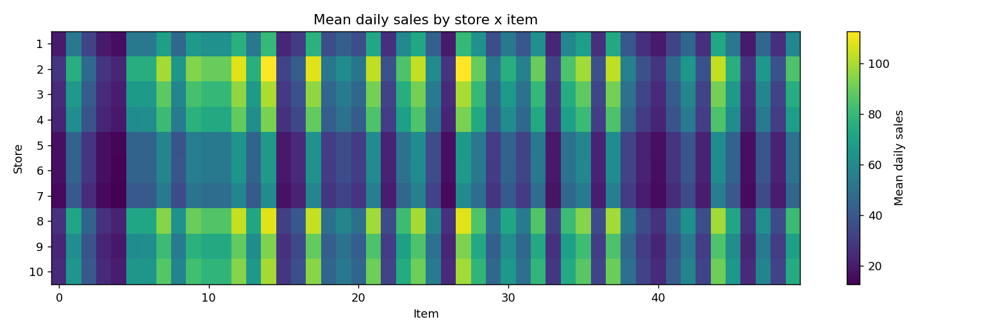

# Demand Forecasting for Multiple Store-Item Time Series

A complete, end-to-end forecasting pipeline for predicting daily demand across **500 related
time series** (10 stores x 50 items), built as part of the **Celebal Technologies Data
Science / ML Internship**.

The project takes 5 years of daily sales history (2013-2017) and produces a 90-day-ahead
(Jan-Mar 2018) demand forecast for every store-item combination, suitable for downstream
inventory planning and supply-chain decisions.

> Dataset: this is the well-known Kaggle **"Store Item Demand Forecasting Challenge"**
> dataset. It ships with the repo under `data/` so the pipeline runs out of the box.

---

## 1. Problem statement

Forecast daily unit sales, 90 days into the future, for 500 store-item series that:

- share a **common yearly seasonal shape** (summer peak, winter trough) and **weekly cycle**
  (weekend uplift),
- individually differ in **scale and growth trend** (some items/stores simply sell more),
- must be forecast **simultaneously and efficiently** — a design that has to scale gracefully
  if the number of stores/items grows well beyond 500.

This rules out fitting 500 independent classical time-series models (ARIMA/ETS per series)
as the primary approach, and instead calls for a **global model** that pools information
across series while still being able to tell them apart.

---

## 2. Approach

### 2.1 Exploratory data analysis (`src/eda.py`)

Confirms the structure the model needs to capture:

| | |
|---|---|
|  | Strong multi-year **upward trend** + repeating **annual seasonality** |
|  | Clear **day-of-week** effect (weekends higher) |
|  | Smooth **within-year seasonality** peaking in summer |
|  | Average demand varies a lot **by store and by item** — series are related but not identical |

### 2.2 Feature engineering (`src/features.py`)

All 500 series are reshaped into a wide **date x store-item pivot table**, which lets every
lag/rolling feature be computed for all series at once with a single vectorised
`.shift()` / `.rolling()` call instead of looping over 500 series:

- **Calendar features**: year, month, day, day-of-week, week-of-year, quarter, weekend flag,
  month-start/end flags, and sine/cosine encodings of month and day-of-week (so the model
  knows December and January are adjacent).
- **Lag features**: sales exactly 7, 14, 21, 28, 35, 60, 90 and 364 days before the target
  date (the 364-day lag captures "same weekday, one year ago" seasonality).
- **Rolling features**: trailing mean/std over 7/14/28/90/365-day windows (computed only on
  data strictly before the target date — no leakage), plus a short-vs-long rolling-mean
  **trend ratio**.
- **Categorical identifiers**: `store` and `item`, so the single global model can still learn
  series-specific baselines and interactions.

### 2.3 Model (`src/train.py`)

A single **LightGBM gradient-boosted tree regressor** is trained on all 500 series jointly.

- **Validation strategy**: trained on data before Jan 2017, validated on **Jan-Mar 2017** —
  matching both the length (90 days) and the seasonal position (Jan-Mar) of the real Jan-Mar
  2018 test period, which is far more representative than a random/shuffled split.
- **Early stopping** on the competition's own metric, **SMAPE** (Symmetric Mean Absolute
  Percentage Error), implemented as a custom LightGBM eval function (`src/utils.py`).
- Feature importance (by gain) confirms the model leans most heavily on `lag_364`
  (yearly seasonality) and short rolling means (`roll_mean_7`, `roll_mean_14`), exactly as the
  EDA suggested it should.

Full results are written to [`reports/model_report.md`](reports/model_report.md).

### 2.4 Recursive multi-horizon forecasting (`src/predict.py`)

Lag/rolling features for day *d* of the 90-day horizon depend on sales for days before *d* —
including days that are themselves *inside* the forecast horizon (e.g. `lag_7` on Jan 15 needs
the prediction for Jan 8). The model is therefore retrained on the **full** 2013-2017 history
and then forecasts **walk-forward, one day at a time**:

```
for each day d in the 90-day horizon (in chronological order):
    1. compute lag/rolling features for d from actual history + predictions already made
    2. predict sales for all 500 series on day d
    3. write the prediction back into the pivot table so later days can use it as history
```

This produces a self-consistent 90-day forecast for every store-item pair, written to
`outputs/submission.csv` in the same `id,sales` format as `sample_submission.csv`.

---

## 3. Results

| Metric | Value |
|---|---|
| Validation window | Jan 1 - Mar 31, 2017 |
| Validation SMAPE | **~13.5** |
| Final training data | Full 2013-2017 history (730k+ rows) |
| Forecast horizon | 90 days (Jan 1 - Mar 31, 2018), 500 series |

(See [`reports/model_report.md`](reports/model_report.md) for the exact number from the last
training run, plus the full feature-importance table.)

---

## 4. Project structure

```
.
├── data/                    # train.csv, test.csv, sample_submission.csv
├── src/
│   ├── utils.py              # SMAPE metric, data loading helpers
│   ├── features.py           # pivot-table based feature engineering
│   ├── eda.py                 # exploratory plots -> reports/figures/
│   ├── train.py               # time-based validation + LightGBM training
│   └── predict.py             # retrain on full data + recursive forecast -> outputs/submission.csv
├── notebooks/
│   └── EDA_and_Modeling.ipynb # narrative walkthrough of the same pipeline
├── models/                   # saved LightGBM models (created on run)
├── outputs/
│   └── submission.csv        # final forecast
├── reports/
│   ├── model_report.md        # validation metrics + feature importance
│   └── figures/                # EDA + feature-importance plots
├── requirements.txt
└── README.md
```

## 5. How to reproduce

```bash
git clone <this-repo-url>
cd store-item-demand-forecasting
pip install -r requirements.txt

python src/eda.py       # regenerate EDA plots in reports/figures/
python src/train.py     # train + validate, writes models/lgbm_model.txt + reports/model_report.md
python src/predict.py   # retrain on full data, recursive forecast, writes outputs/submission.csv
```

Everything is deterministic (`seed=42`) and runs end-to-end in a few minutes on a laptop CPU —
no GPU required.

## 6. Design choices & possible extensions

- **Why one global model instead of 500 local models?** It scales to far more series without
  a linear blow-up in training/maintenance cost, and it lets sparse or noisy series borrow
  seasonal structure from similar store-item pairs.
- **Why LightGBM and not ARIMA/Prophet/deep learning?** Gradient-boosted trees handle the
  mixed categorical + numeric feature set naturally, train fast even on 500 series x 5 years
  of daily data, and are a strong, well-understood baseline for this class of problem.
- **Extensions worth trying next**: quantile/probabilistic forecasts (prediction intervals for
  safety-stock decisions), a hierarchical reconciliation step (store-level and item-level
  totals should sum consistently), and a sequence model (e.g. Temporal Fusion Transformer) as
  a second opinion to ensemble with the tree model.

## 7. Author / Internship

Prepared as a project submission for the **Celebal Technologies Summer Internship (Data
Science)**.
