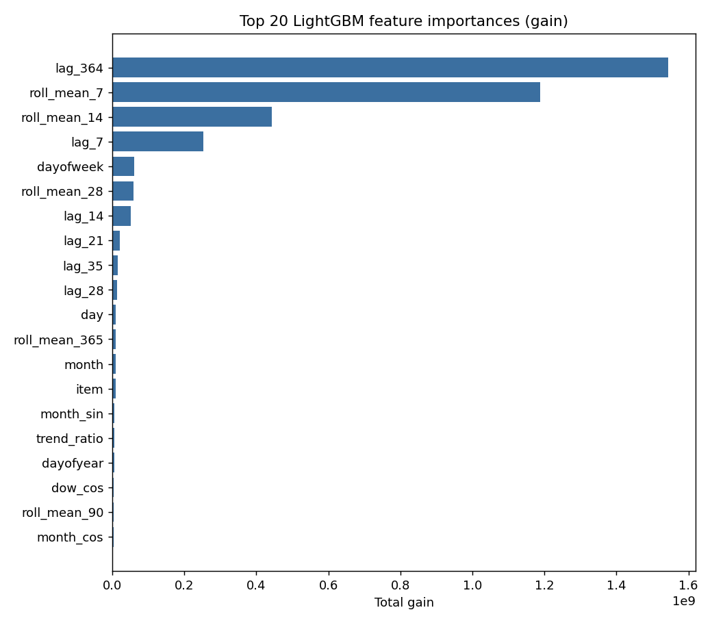

# Model training report

- Training rows: 548,000
- Validation window: 2017-01-01 to 2017-03-31 (45,000 rows)
- Best boosting iteration (early stopping): **956**
- Validation SMAPE: **13.5027**

## Top features by gain

| feature       |        gain |
|:--------------|------------:|
| lag_364       | 1.54366e+09 |
| roll_mean_7   | 1.1882e+09  |
| roll_mean_14  | 4.42264e+08 |
| lag_7         | 2.53196e+08 |
| dayofweek     | 6.05447e+07 |
| roll_mean_28  | 5.94782e+07 |
| lag_14        | 5.09632e+07 |
| lag_21        | 2.01416e+07 |
| lag_35        | 1.44039e+07 |
| lag_28        | 1.40115e+07 |
| day           | 9.93063e+06 |
| roll_mean_365 | 9.34378e+06 |
| month         | 9.32333e+06 |
| item          | 9.00955e+06 |
| month_sin     | 5.97547e+06 |
| trend_ratio   | 5.96331e+06 |
| dayofyear     | 4.88084e+06 |
| dow_cos       | 3.92247e+06 |
| roll_mean_90  | 3.85404e+06 |
| month_cos     | 3.85051e+06 |

